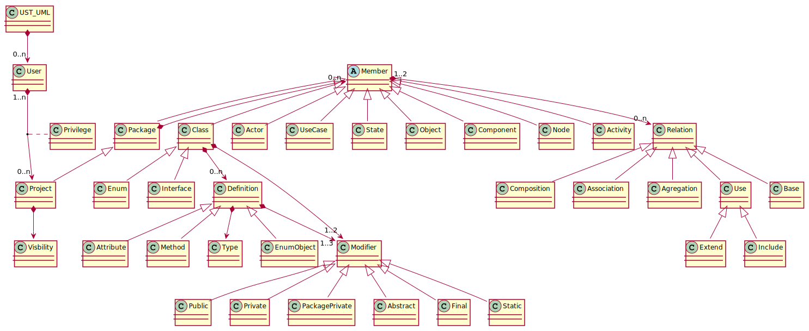
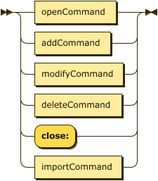
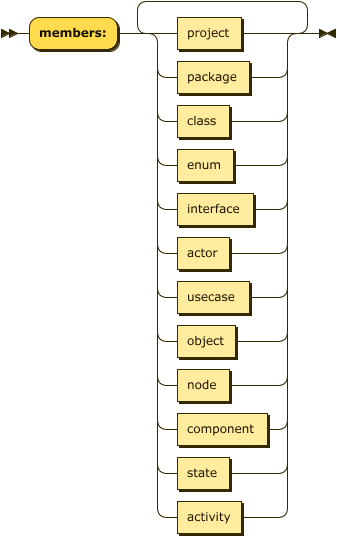
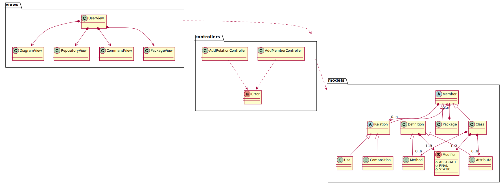

# UST_UML_TOOL  
Universo Santa Tecla  
[uSantaTecla@gmail.com](mailto:uSantaTecla@gmail.com)  

**Índice**  

1. [Modelo del dominio](#modelo-del-dominio)  
   1.1. [Lenguaje](#lenguaje)  
      1.1.1. [Sintaxis](#sintaxis)  
      1.1.2. [Ejemplos Comandos](#ejemplos-comandos)  
2. [Requisitos](#requisitos)  
   2.1. [Actores y casos de uso](#actores-y-casos-de-uso)  
   2.2. [Contexto](#contexto)  
   2.3. [Prototipo de Interfaz](#prototipo-de-interfaz)  
3. [Analisis](#analisis)  
   3.1. [Casos de uso](#casos-de-uso)  
      3.1.1. [Add Member](#add-member)  
      3.1.2. [Add Relation](#add-relation)  
4. [Diseño](#diseño)  
   4.1. [Vista de Despliegue](#vista-de-despliegue)  
   4.2. [Trazabilidad Analisis/Diseño](#trazabilidad-analisis/diseño)  

## Modelo del dominio  
  
  

## Disciplina de Requisitos  
### Actores y Casos de uso  
  

### Contexto  
  

* * *
### Prototipo de interfaz  
#### Interfaz
  

#### Gramática del lenguaje  

##### Comando add
<a name="UST_UML">UST_UML:</a>

<map name="UST_UML.map"><area shape="rect" coords="49,1,157,33" href="#addCommand" title="addCommand"><area shape="rect" coords="49,45,161,77" href="#deleteComand" title="deleteComand"><area shape="rect" coords="49,89,175,121" href="#modifyCommand" title="modifyCommand"><area shape="rect" coords="49,133,165,165" href="#openCommand" title="openCommand"><area shape="rect" coords="49,177,165,209" href="#closeCommand" title="closeCommand"></map>

no references

<a name="addCommand">addCommand:</a>

<map name="addCommand.map"><area shape="rect" coords="119,33,197,65" href="#members" title="members"><area shape="rect" coords="257,33,333,65" href="#relations" title="relations"><area shape="rect" coords="393,33,447,65" href="#users" title="users"></map>

referenced by:

*   [UST_UML](#UST_UML "UST_UML")

<a name="members">members:</a>

<map name="members.map"><area shape="rect" coords="177,17,241,49" href="#project" title="project"><area shape="rect" coords="177,61,249,93" href="#package" title="package"><area shape="rect" coords="177,105,229,137" href="#class" title="class"><area shape="rect" coords="177,149,233,181" href="#enum" title="enum"><area shape="rect" coords="177,193,253,225" href="#interface" title="interface"><area shape="rect" coords="177,237,229,269" href="#actor" title="actor"><area shape="rect" coords="177,281,249,313" href="#usecase" title="usecase"><area shape="rect" coords="177,325,235,357" href="#object" title="object"><area shape="rect" coords="177,369,229,401" href="#node" title="node"><area shape="rect" coords="177,413,267,445" href="#component" title="component"><area shape="rect" coords="177,457,229,489" href="#state" title="state"><area shape="rect" coords="177,501,241,533" href="#activity" title="activity"></map>

referenced by:

*   [addCommand](#addCommand "addCommand")

<a name="class">class:</a>

<map name="class.map"><area shape="rect" coords="107,1,183,33" href="#identifier" title="identifier"><area shape="rect" coords="223,33,301,65" href="#modifiers" title="modifiers"><area shape="rect" coords="361,33,469,65" href="#classMembers" title="classMembers"><area shape="rect" coords="529,33,605,65" href="#relations" title="relations"></map>

referenced by:

*   [members](#members "members")

<a name="identifier">identifier:</a>

referenced by:

*   [class](#class "class")
*   [member](#member "member")
*   [relations](#relations "relations")
*   [type](#type "type")

<a name="modifiers">modifiers:</a>

<map name="modifiers.map"><area shape="rect" coords="157,33,213,65" href="#public" title="public"><area shape="rect" coords="157,77,229,109" href="#package" title="package"></map>

referenced by:

*   [class](#class "class")

<a name="classMembers">classMembers:</a>

<map name="classMembers.map"><area shape="rect" coords="157,17,229,49" href="#member" title="member"></map>

referenced by:

*   [class](#class "class")

<a name="member">member:</a>

<map name="member.map"><area shape="rect" coords="419,1,467,33" href="#type" title="type"><area shape="rect" coords="487,1,563,33" href="#identifier" title="identifier"><area shape="rect" coords="327,121,375,153" href="#type" title="type"><area shape="rect" coords="395,121,471,153" href="#identifier" title="identifier"><area shape="rect" coords="577,121,625,153" href="#type" title="type"><area shape="rect" coords="645,121,721,153" href="#identifier" title="identifier"></map>

referenced by:

*   [classMembers](#classMembers "classMembers")

<a name="type">type:</a>

<map name="type.map"><area shape="rect" coords="49,265,125,297" href="#identifier" title="identifier"></map>

referenced by:

*   [member](#member "member")

<a name="relations">relations:</a>

<map name="relations.map"><area shape="rect" coords="125,1,201,33" href="#identifier" title="identifier"><area shape="rect" coords="215,45,291,77" href="#identifier" title="identifier"></map>

referenced by:

*   [addCommand](#addCommand "addCommand")
*   [class](#class "class")

#### Semántica de comandos  
* Todos los comandos desarrollados son autoexplicativos y estructurados 
* Siguen una composicion sistemática

*Comandos comunes*

~~~
close:
~~~

~~~
open: Member
~~~

*User account context*
~~~
add:
  members:
    - project: Project1
    - project: Project2
      members: 
        - package: package
          members:
            - class: class
~~~

~~~
modify:
  members:
    - project: Project
      set: NewProject
~~~

~~~
delete:
  members:
    - project: Project 
~~~
  
*Project & Package context*
~~~
add:
    members:
       - package: package
       - class: class
         modifiers: public abstract
       - enum: enum
       - interface: interface
    relations:
       - inheritance: Member
         role: role
       - composition: Member
       - aggregation: Member
         role: role
       - association: Member
       - use: Member
~~~

~~~
modify:
  members:
    - class: Class
      set: NewClass
  relations:
    - inheritance: Member
      set: NewMember
      role: newRole
~~~

~~~
delete:
  members:
    - interface: Interface
  relations:
    - composition: Member 
~~~

*Class & Interface context*
~~~
add:
    members:
      - member: private static int attribute
      - member: public abstract String method(int param1, String param2)
    relations:
      - association: Member 
~~~

~~~
modify:
  modifiers: package
  set: public abstract
  members:
    - member: private static int attribute
      set: public String newAttribute
    - member: public abstract String method(int param1, String param2)
      set: private int newMethod()
  relations:
    - use: Member
      set: NewMember
      role: newRole
~~~

~~~
delete:
  members:
    - member: public String newAttribute
    - member: private int newMethod()
  relations:
    - composition: Member 
~~~

*Enum context*

* Adicional a los comandos de las clases y las interfaces

~~~
add:
  objects:
    - object: OBJECT
~~~

~~~
modify:
  objects:
    - object: OBJECT
      set: NEWOBJECT
~~~

~~~
delete:
  objects:
    - object: OBJECT
~~~  
* * *
## Disciplina de Análisis  
### Arquitectura de Análisis  
  

### Análisis de casos de uso
#### Add Member  
  

#### Add Relation  
  

* Debido a la sistematicidad ya comentada de los comandos no fue necesario seguir haciendo análisis para los distintos casos de uso de los comandos restantes.
## Disciplina de Diseño  

### Arquitectura del sistema de diseño
  
### Diseño de casos de uso
 

Explicar las tecnologías usadas y su estructuración

Poner ejemplos de patrones como el interprete en nuestro caso, con algún hiperenlace al código y algún trozo de código

## Disciplina de Pruebas 

Sonar, pruebas unitarias, sistema ...
* Las tecnologías utilizadas en el desarrollo de las pruebas ha sido:
  - Junit5
  - Mockito
  - Base de datos embebida para mongoDB    

* El objetivo principal de las pruebas de ingeniería directa ha sido ejercitar los diferentes comandos del lenguaje en cada uno de los contextos, y así poder medir la calidad del software, validar que el sistema funciona como se espera y que los requisitos son implementados correctamente.    

* Para la realización de las pruebas en la parte de ingeniería inversa, se han ejercitado los parseadores con proyecto de prueba que contenía código que simula los distintos escenarios a tener en cuenta para la generación de los miembros y sus relaciones.  

Imagen de sonar con el coverage del codigo
## Disciplina de Despliegue  
Despliegue, integración continua ...
### Ecosistema
