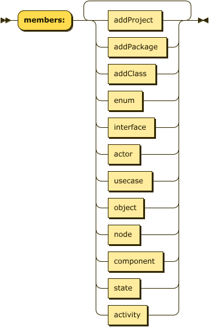
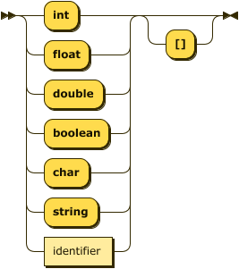
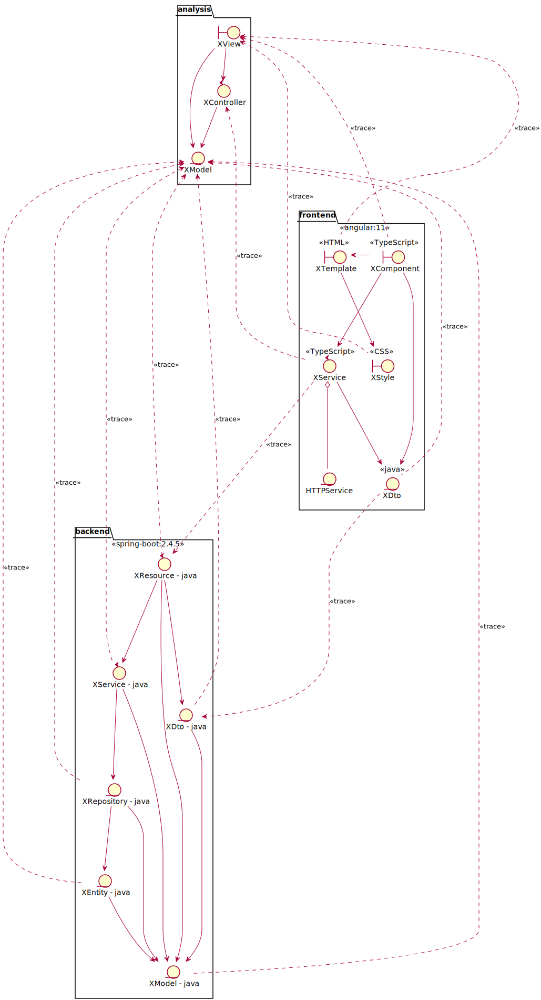

# UST_UML_TOOL  
Universo Santa Tecla  
[uSantaTecla@gmail.com](mailto:uSantaTecla@gmail.com)  

**Índice**  

1. [Objetivos](#white_check_mark-objetivos)  
   - 1.2. [Modelo del dominio](#modelo-del-dominio)  
2. [Disciplina de Requisitos](#disciplina-de-requisitos)  
   2.1. [Actores y casos de uso](#actores-y-casos-de-uso)   
   2.2. [Contexto](#contexto)  
   2.3. [Prototipo de Interfaz](#prototipo-de-interfaz)  
      - 2.4. [Gramática del lenguaje](#gramática-del-lenguaje)  
      - 2.5. [Semántica de comandos](#semántica-de-comandos)  
3. [Disciplina de Analisis](#disciplina-de-análisis)  
   3.1. [Arquitectura de análisis](#arquitectura-de-análisis)  
   3.2. [Análisis de casos de uso](#análisis-de-casos-de-uso)  
      - 3.2.1. [Add Member](#add-member)  
      - 3.2.2. [Add Relation](#add-relation)  
4. [Disciplina de Diseño](#disciplina-de-diseño)  
   4.1. [Arquitectura del sistema de diseño](#arquitectura-del-sistema-de-diseño)  
   4.2. [Diseño de casos de uso](#diseño-de-casos-de-uso)  
5. [Disciplina de Pruebas](#disciplina-de-pruebas)  
6. [Disciplina de Despliegue](#disciplina-de-despliegue)  

* * *

## :white_check_mark: Objetivos
 Los objetivos principales de este proyecto son, por un lado, aunar correctamente los diferentes conocimientos adquiridos a lo largo del Máster en Ingeniería Web y, por otro lado, facilitar la generación de documentación para los proyectos software. Los conocimientos utilizados a destacar serían los aprendidos en las asignaturas:
- Ingeniería Web Visión General.
- Arquitectura y Patrones para Aplicaciones Web.
- Front-end para Navegadores Web.
- Back-end con Tecnologías de Código Abierto.
- Metodologías de desarrollo web.

Para ello se desarrollará una aplicación web utilizando la metodología de desarrollo de software Rational Unified Process, el framework Spring para el desarrollo de la capa de negocio, el framework Angular para el desarrollo de la capa de presentación y MongoDB para la capa de datos.
Añadir que otro objetivo importante es trabajar en equipo para así simular un proyecto real. Para ello, este proyecto se desarrollará conjuntamente con (Nombres de los demás) ampliando así sus funcionalidades como se puede ver en su TFM (Nombre TFM).  

También nos hemos propuesto implementar el proyecto siguiendo una arquitectura hexagonal y los principios de código limpio como SOLID, evitar smell codes, etc. así como aplicar patrones de diseño que aumenten la extensibilidad y legibilidad del código.

La aplicación web a desarrollar será USTUML, la cual consiste en permitir la generación efectiva de diagramas UML a través de ingeniería directa y de ingeniería inversa para así poder mejorar la gestión de cualquier proyecto software. La ingeniería directa se realizará mediante técnica declarativa, concretamente a través de la ejecución de comandos, y la ingeniería inversa a partir de código fuente en java, alojado en GitHub. 

Se ha elegido el desarrollo de esta aplicación web debido a que nos planteaba un reto importante: la idea del proyecto venía dada por nuestro tutor, hecho que nos obligaba a interpretar sus ideas y transformarlas en algo tangible, como si de un cliente real se tratase. Esto desembocó en que el análisis contemplase un solo actor y diversos casos de uso que se especificarán posteriormente en este documento.

### Modelo del dominio  
  
  
* * *
## Disciplina de Requisitos  
### Actores y Casos de uso  
  

### Contexto  
  

### Prototipo de interfaz  
#### Interfaz
  

#### Gramática del lenguaje  

##### Comando add
<a name="UST_UML">UST_UML:</a>

<map name="UST_UML.map"><area shape="rect" coords="49,1,157,33" href="#addCommand" title="addCommand"><area shape="rect" coords="49,45,173,77" href="#deleteCommand" title="deleteCommand"><area shape="rect" coords="49,89,175,121" href="#modifyCommand" title="modifyCommand"><area shape="rect" coords="49,133,165,165" href="#openCommand" title="openCommand"></map>

no references

<a name="openCommand">openCommand:</a>

<map name="openCommand.map"><area shape="rect" coords="107,1,191,33" href="#indentifier" title="indentifier"></map>

referenced by:

*   [UST_UML](#UST_UML "UST_UML")

<a name="project">project:</a>

<map name="project.map"><area shape="rect" coords="121,1,197,33" href="#identifier" title="identifier"></map>

referenced by:

*   [addProject](#addProject "addProject")
*   [deleteMembers](#deleteMembers "deleteMembers")
*   [modifyMembers](#modifyMembers "modifyMembers")

<a name="package">package:</a>

<map name="package.map"><area shape="rect" coords="129,1,205,33" href="#identifier" title="identifier"></map>

referenced by:

*   [addPackage](#addPackage "addPackage")
*   [deleteMembers](#deleteMembers "deleteMembers")
*   [modifiers](#modifiers "modifiers")
*   [modifyMembers](#modifyMembers "modifyMembers")

<a name="class">class:</a>

<map name="class.map"><area shape="rect" coords="107,1,183,33" href="#identifier" title="identifier"></map>

referenced by:

*   [addClass](#addClass "addClass")
*   [deleteMembers](#deleteMembers "deleteMembers")
*   [modifyMembers](#modifyMembers "modifyMembers")

<a name="addCommand">addCommand:</a>

<map name="addCommand.map"><area shape="rect" coords="119,33,221,65" href="#addMembers" title="addMembers"><area shape="rect" coords="281,33,357,65" href="#relations" title="relations"><area shape="rect" coords="417,33,471,65" href="#users" title="users"></map>

referenced by:

*   [UST_UML](#UST_UML "UST_UML")

<a name="addMembers">addMembers:</a>

<map name="addMembers.map"><area shape="rect" coords="177,17,265,49" href="#addProject" title="addProject"><area shape="rect" coords="177,61,273,93" href="#addPackage" title="addPackage"><area shape="rect" coords="177,105,255,137" href="#addClass" title="addClass"><area shape="rect" coords="177,149,233,181" href="#enum" title="enum"><area shape="rect" coords="177,193,253,225" href="#interface" title="interface"><area shape="rect" coords="177,237,229,269" href="#actor" title="actor"><area shape="rect" coords="177,281,249,313" href="#usecase" title="usecase"><area shape="rect" coords="177,325,235,357" href="#object" title="object"><area shape="rect" coords="177,369,229,401" href="#node" title="node"><area shape="rect" coords="177,413,267,445" href="#component" title="component"><area shape="rect" coords="177,457,229,489" href="#state" title="state"><area shape="rect" coords="177,501,241,533" href="#activity" title="activity"></map>

referenced by:

*   [addCommand](#addCommand "addCommand")
*   [addPackage](#addPackage "addPackage")
*   [addProject](#addProject "addProject")

<a name="addProject">addProject:</a>

<map name="addProject.map"><area shape="rect" coords="29,1,93,33" href="#project" title="project"><area shape="rect" coords="133,33,235,65" href="#addMembers" title="addMembers"><area shape="rect" coords="295,33,371,65" href="#relations" title="relations"></map>

referenced by:

*   [addMembers](#addMembers "addMembers")

<a name="addPackage">addPackage:</a>

<map name="addPackage.map"><area shape="rect" coords="29,1,101,33" href="#package" title="package"><area shape="rect" coords="141,33,243,65" href="#addMembers" title="addMembers"><area shape="rect" coords="303,33,379,65" href="#relations" title="relations"></map>

referenced by:

*   [addMembers](#addMembers "addMembers")

<a name="addClass">addClass:</a>

<map name="addClass.map"><area shape="rect" coords="29,1,81,33" href="#class" title="class"><area shape="rect" coords="121,33,199,65" href="#modifiers" title="modifiers"><area shape="rect" coords="259,33,367,65" href="#classMembers" title="classMembers"><area shape="rect" coords="427,33,503,65" href="#relations" title="relations"></map>

referenced by:

*   [addMembers](#addMembers "addMembers")

<a name="identifier">identifier:</a>

referenced by:

*   [class](#class "class")
*   [definition](#definition "definition")
*   [package](#package "package")
*   [project](#project "project")
*   [relations](#relations "relations")
*   [type](#type "type")

<a name="modifiers">modifiers:</a>

<map name="modifiers.map"><area shape="rect" coords="157,33,213,65" href="#public" title="public"><area shape="rect" coords="157,77,229,109" href="#package" title="package"></map>

referenced by:

*   [addClass](#addClass "addClass")

<a name="classMembers">classMembers:</a>

<map name="classMembers.map"><area shape="rect" coords="157,17,235,49" href="#definition" title="definition"></map>

referenced by:

*   [addClass](#addClass "addClass")

<a name="definition">definition:</a>

<map name="definition.map"><area shape="rect" coords="419,1,467,33" href="#type" title="type"><area shape="rect" coords="487,1,563,33" href="#identifier" title="identifier"><area shape="rect" coords="327,121,375,153" href="#type" title="type"><area shape="rect" coords="395,121,471,153" href="#identifier" title="identifier"><area shape="rect" coords="577,121,625,153" href="#type" title="type"><area shape="rect" coords="645,121,721,153" href="#identifier" title="identifier"></map>

referenced by:

*   [classMembers](#classMembers "classMembers")

<a name="type">type:</a>

<map name="type.map"><area shape="rect" coords="49,265,125,297" href="#identifier" title="identifier"></map>

referenced by:

*   [definition](#definition "definition")

<a name="relations">relations:</a>

<map name="relations.map"><area shape="rect" coords="125,1,201,33" href="#identifier" title="identifier"><area shape="rect" coords="215,45,291,77" href="#identifier" title="identifier"></map>

referenced by:

*   [addClass](#addClass "addClass")
*   [addCommand](#addCommand "addCommand")
*   [addPackage](#addPackage "addPackage")
*   [addProject](#addProject "addProject")
*   [deleteCommand](#deleteCommand "deleteCommand")
*   [modifyCommand](#modifyCommand "modifyCommand")

<a name="modifyCommand">modifyCommand:</a>

<map name="modifyCommand.map"><area shape="rect" coords="141,33,261,65" href="#modifyMembers" title="modifyMembers"><area shape="rect" coords="321,33,397,65" href="#relations" title="relations"><area shape="rect" coords="457,33,511,65" href="#users" title="users"></map>

referenced by:

*   [UST_UML](#UST_UML "UST_UML")

<a name="modifyMembers">modifyMembers:</a>

<map name="modifyMembers.map"><area shape="rect" coords="177,17,241,49" href="#project" title="project"><area shape="rect" coords="177,61,249,93" href="#package" title="package"><area shape="rect" coords="177,105,229,137" href="#class" title="class"><area shape="rect" coords="177,149,233,181" href="#enum" title="enum"><area shape="rect" coords="177,193,253,225" href="#interface" title="interface"><area shape="rect" coords="177,237,229,269" href="#actor" title="actor"><area shape="rect" coords="177,281,249,313" href="#usecase" title="usecase"><area shape="rect" coords="177,325,235,357" href="#object" title="object"><area shape="rect" coords="177,369,229,401" href="#node" title="node"><area shape="rect" coords="177,413,267,445" href="#component" title="component"><area shape="rect" coords="177,457,229,489" href="#state" title="state"><area shape="rect" coords="177,501,241,533" href="#activity" title="activity"><area shape="rect" coords="373,17,477,49" href="#newIdentifier" title="newIdentifier"></map>

referenced by:

*   [modifyCommand](#modifyCommand "modifyCommand")

<a name="deleteCommand">deleteCommand:</a>

<map name="deleteCommand.map"><area shape="rect" coords="135,33,253,65" href="#deleteMembers" title="deleteMembers"><area shape="rect" coords="313,33,389,65" href="#relations" title="relations"><area shape="rect" coords="449,33,503,65" href="#users" title="users"></map>

referenced by:

*   [UST_UML](#UST_UML "UST_UML")

<a name="deleteMembers">deleteMembers:</a>

<map name="deleteMembers.map"><area shape="rect" coords="177,17,241,49" href="#project" title="project"><area shape="rect" coords="177,61,249,93" href="#package" title="package"><area shape="rect" coords="177,105,229,137" href="#class" title="class"><area shape="rect" coords="177,149,233,181" href="#enum" title="enum"><area shape="rect" coords="177,193,253,225" href="#interface" title="interface"><area shape="rect" coords="177,237,229,269" href="#actor" title="actor"><area shape="rect" coords="177,281,249,313" href="#usecase" title="usecase"><area shape="rect" coords="177,325,235,357" href="#object" title="object"><area shape="rect" coords="177,369,229,401" href="#node" title="node"><area shape="rect" coords="177,413,267,445" href="#component" title="component"><area shape="rect" coords="177,457,229,489" href="#state" title="state"><area shape="rect" coords="177,501,241,533" href="#activity" title="activity"></map>

referenced by:

*   [deleteCommand](#deleteCommand "deleteCommand")

<a name="importCommand">importCommand:</a>

<map name="importCommand.map"><area shape="rect" coords="119,1,229,33" href="#urlGitHubRepo" title="urlGitHubRepo"></map>

referenced by:

*   [UST_UML](#UST_UML "UST_UML")

#### Semántica de comandos  
* Todos los comandos desarrollados son autoexplicativos y estructurados 
* Siguen una composicion sistemática

######  Comandos comunes
~~~
open: Member
~~~

~~~
close:
~~~
###### Ingeniería directa

*User account context*
~~~
add:
  members:
    - project: Project1
    - project: Project2
      members: 
        - package: package
          members:
            - class: class
~~~

~~~
modify:
  members:
    - project: Project
      set: NewProject
~~~

~~~
delete:
  members:
    - project: Project 
~~~
  
*Project & Package context*
~~~
add:
    members:
       - package: package
       - class: class
         modifiers: public abstract
       - enum: enum
       - interface: interface
    relations:
       - inheritance: Member
         role: role
       - composition: Member
       - aggregation: Member
         role: role
       - association: Member
       - use: Member
~~~

~~~
modify:
  members:
    - class: Class
      set: NewClass
  relations:
    - inheritance: Member
      set: NewMember
      role: newRole
~~~

~~~
delete:
  members:
    - interface: Interface
  relations:
    - composition: Member 
~~~

*Class & Interface context*
~~~
add:
    members:
      - member: private static int attribute
      - member: public abstract String method(int param1, String param2)
    relations:
      - association: Member 
~~~

~~~
modify:
  modifiers: package
  set: public abstract
  members:
    - member: private static int attribute
      set: public String newAttribute
    - member: public abstract String method(int param1, String param2)
      set: private int newMethod()
  relations:
    - use: Member
      set: NewMember
      role: newRole
~~~

~~~
delete:
  members:
    - member: public String newAttribute
    - member: private int newMethod()
  relations:
    - composition: Member 
~~~

*Enum context*

* Adicional a los comandos de las clases y las interfaces

~~~
add:
  objects:
    - object: OBJECT
~~~

~~~
modify:
  objects:
    - object: OBJECT
      set: NEWOBJECT
~~~

~~~
delete:
  objects:
    - object: OBJECT
~~~  
###### Ingeniería inversa
~~~
import: urlGitHubRepository
~~~  
* * *
## Disciplina de Análisis  
### Arquitectura de Análisis  
  

### Análisis de casos de uso
#### Add Member  
  

#### Add Relation  
  

* Debido a la sistematicidad ya comentada de los comandos no fue necesario seguir haciendo análisis para los distintos casos de uso de los comandos restantes.
* * *
## Disciplina de Diseño  

### Arquitectura del sistema de diseño
  
### Diseño de casos de uso
 

Explicar las tecnologías usadas y su estructuración

Poner ejemplos de patrones como el interprete en nuestro caso, con algún hiperenlace al código y algún trozo de código
* * *
## Disciplina de Pruebas 

Sonar, pruebas unitarias, sistema ...
* Las tecnologías utilizadas en el desarrollo de las pruebas ha sido:
  - Back-end:
    - Junit5
    - Mockito
    - Base de datos embebida para mongoDB  
  - Front-end:
    - Jasmine
    - Karma  

* El objetivo principal de las pruebas de ingeniería directa ha sido ejercitar los diferentes comandos del lenguaje en cada uno de los contextos, y así poder medir la calidad del software, validar que el sistema funciona como se espera y que los requisitos son implementados correctamente.    

* Para la realización de las pruebas en la parte de ingeniería inversa, se han ejercitado los parseadores con proyecto de prueba que contenía código que simula los distintos escenarios a tener en cuenta para la generación de los miembros y sus relaciones.  

Imagen de sonar con el coverage del codigo
* * *
## Disciplina de Despliegue  
Despliegue, integración continua ...
### Ecosistema
